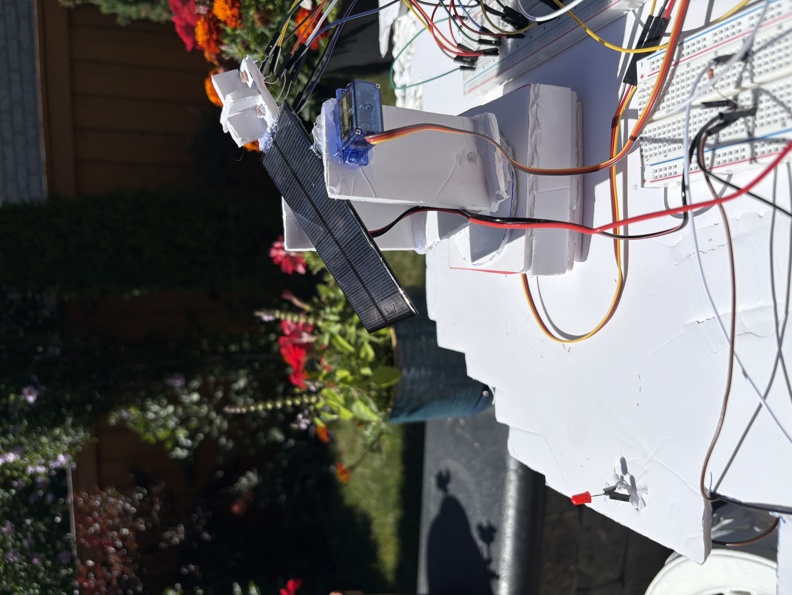
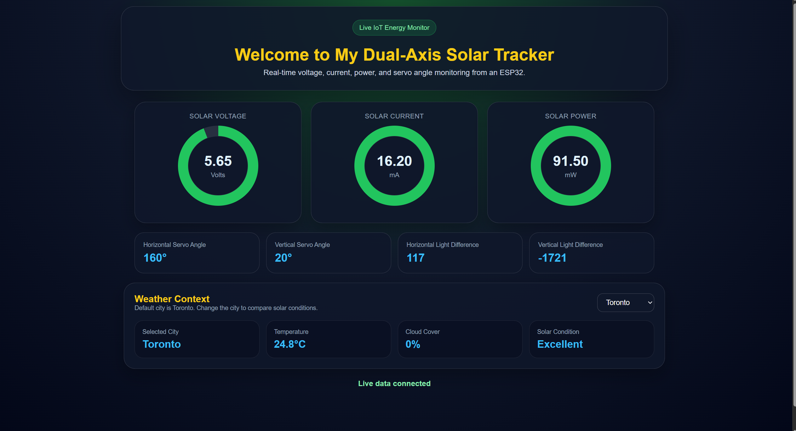
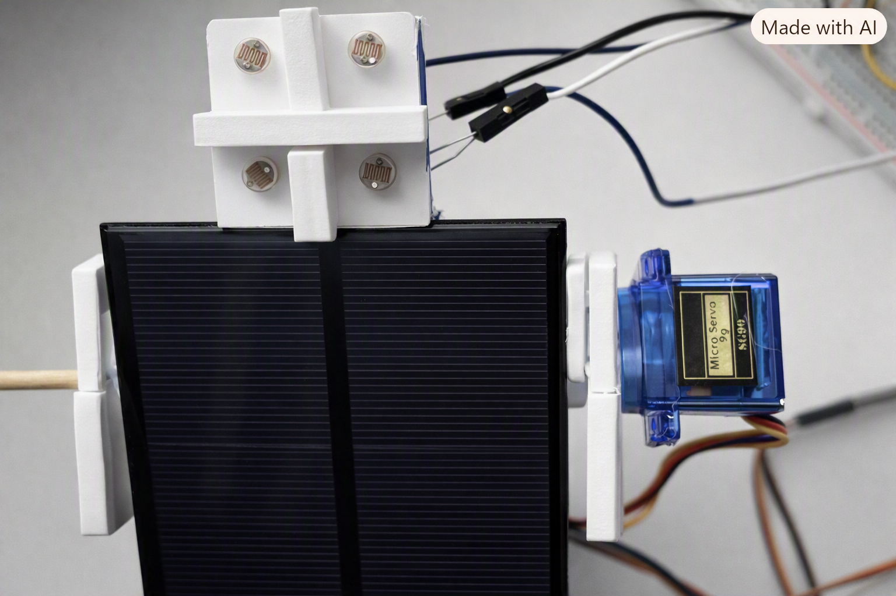
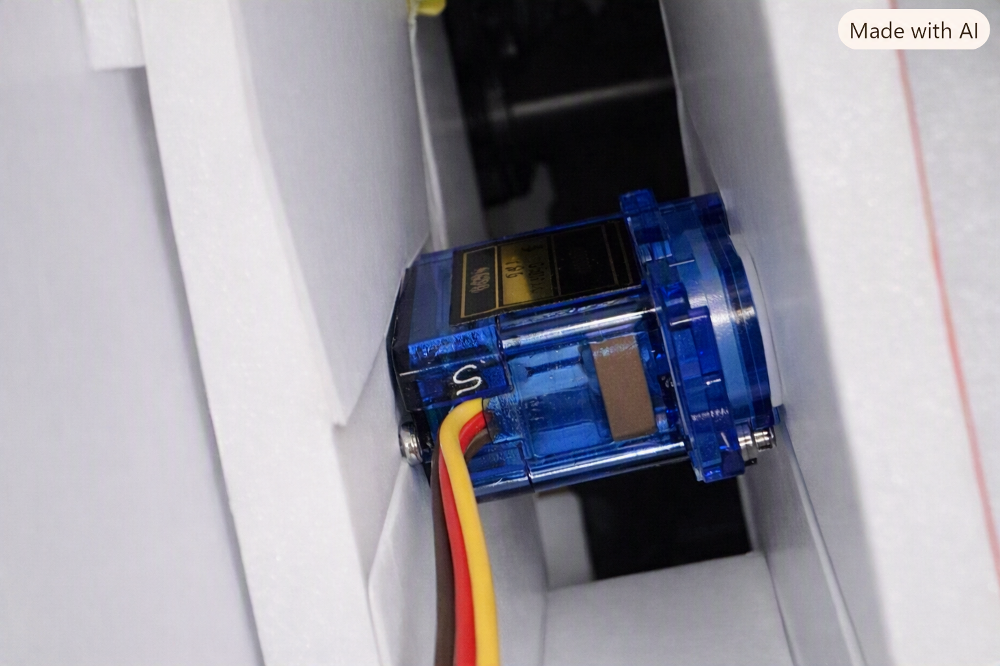

# IoT Dual-Axis Solar Tracker with Real-Time Energy Dashboard

<p align="center">
  
</p>

<p align="center">
  <b>ESP32-based solar tracker using LDR feedback, servo control, INA219 power sensing, and a live WiFi dashboard.</b>
</p>

---

## Overview

This project is a working **dual-axis solar tracker** built with an ESP32, four LDR light sensors, two servo motors, a small solar panel, and an INA219 voltage/current sensor. The system automatically adjusts the position of the solar panel toward the strongest light source and displays real-time energy data on a web dashboard hosted directly by the ESP32.

The dashboard shows:

- Solar voltage
- Solar current
- Solar power
- Horizontal and vertical servo angles
- Horizontal and vertical light-difference values
- Weather context with a selectable city dropdown

The goal of the project is to combine **embedded systems**, **IoT**, **sensor feedback**, **servo control**, and **renewable-energy monitoring** into one practical prototype.

---

## Demo

<p align="center">
  
</p>

The ESP32 connects to WiFi and hosts a local webpage. A phone or laptop on the same WiFi network can open the ESP32 IP address and view the live dashboard.

Example:

```text
http://10.0.0.93
```

---

## Features

- **Dual-axis tracking:** Tracks light horizontally and vertically.
- **Four-LDR sensor array:** Compares light levels from top-left, top-right, bottom-left, and bottom-right sensors.
- **Servo-controlled movement:** Uses two SG90 micro servos for left/right rotation and up/down tilt.
- **Solar power sensing:** Uses an INA219 sensor to measure voltage and current.
- **Manual power calculation:** Calculates power in milliwatts using voltage × current.
- **Live WiFi dashboard:** ESP32 hosts a local web dashboard on port 80.
- **Gauge-style visualizations:** Voltage, current, and power are shown as circular gauges.
- **Weather context:** Dashboard includes a weather dropdown with Toronto as the default city.
- **Safe movement limits:** Servo angles are constrained between 20° and 160°.
- **Calibration step:** LDR baseline values are captured at startup to improve tracking accuracy.

---

## Final Prototype Photos

| Full Prototype | LDR Sensor Array |
|---|---|
|  |  |

| INA219 Power Sensor | ESP32 Controller |
|---|---|
|  |  |

| Horizontal Servo Base |
|---|
|  |

---

## Hardware Used

| Component | Purpose |
|---|---|
| ESP32 Dev Board | Main microcontroller, WiFi server, sensor reading, and servo control |
| 4× LDR sensors | Detect light direction around the solar panel |
| 4× 10 kΩ resistors | Create voltage dividers for the LDR sensors |
| 2× SG90 micro servos | Move the panel horizontally and vertically |
| INA219 sensor | Measure solar panel voltage and current |
| Small solar panel | Renewable-energy source being tracked |
| LED + resistor | Simple load for the solar panel |
| Breadboard and jumper wires | Circuit connections |
| Foam board / hot glue | Physical prototype structure |
| External battery pack | Servo power supply |

---

## Pin Mapping

| Device | ESP32 Pin |
|---|---|
| Top-left LDR | GPIO34 |
| Top-right LDR | GPIO35 |
| Bottom-left LDR | GPIO32 |
| Bottom-right LDR | GPIO33 |
| Horizontal servo signal | GPIO18 |
| Vertical servo signal | GPIO19 |
| INA219 SDA | GPIO21 |
| INA219 SCL | GPIO22 |
| INA219 VCC | 3.3V |
| INA219 GND | GND |

---

## Power Setup

The ESP32 and servos are powered separately to avoid brownouts and unstable servo behavior.

```text
ESP32 USB power       → powers ESP32, LDR sensors, and INA219 logic side
External battery pack → powers servo motors
Common ground         → connects ESP32 GND, servo GND, INA219 GND, and solar/load ground
```

Important: all grounds must be connected together, but the ESP32 3.3V rail should not be used to power the servos.

---

## How the Tracking System Works

The tracker uses four LDR sensors placed around the solar panel:

```text
Top Left      Top Right

Bottom Left   Bottom Right
```

The ESP32 reads each LDR as an analog value, then calculates average light levels for each side.

### Horizontal Tracking

```cpp
avgLeft  = (topLeft + bottomLeft) / 2;
avgRight = (topRight + bottomRight) / 2;
dhoriz = avgLeft - avgRight;
```

If the left side is brighter than the right side, the bottom servo moves one direction. If the right side is brighter, it moves the opposite direction.

### Vertical Tracking

```cpp
avgTop = (topLeft + topRight) / 2;
avgBottom = (bottomLeft + bottomRight) / 2;
dvert = avgTop - avgBottom;
```

If the top sensors receive more light than the bottom sensors, the tilt servo adjusts the panel angle. If the bottom sensors receive more light, it moves the other way.

### Tolerance

```cpp
int tolerance = 500;
```

The tolerance prevents the servos from moving due to tiny changes or sensor noise. The tracker only moves when the light difference is large enough.

---

## How the Servo Control Works

The project uses two servos:

```cpp
Servo horizontal;   // bottom servo = left/right
Servo vertical;     // top servo = up/down
```

The starting position is 90°:

```cpp
int servohori = 90;
int servovert = 90;
```

The movement range is limited:

```cpp
int servohoriLimitHigh = 160;
int servohoriLimitLow  = 20;

int servovertLimitHigh = 160;
int servovertLimitLow  = 20;
```

This prevents the servos from over-rotating and damaging the foam structure or pulling wires.

---

## INA219 Power Monitoring

The INA219 sensor measures solar-panel voltage and current. The code calculates power manually:

```cpp
busVoltage = ina219.getBusVoltage_V();
current_mA = ina219.getCurrent_mA();
power_mW = busVoltage * current_mA;
```

Because volts × milliamps = milliwatts, this gives the solar output power in mW.

Example outdoor readings from testing were around:

```text
Voltage: 5.66–5.71 V
Current: 15.6–16.4 mA
Power: 88–94 mW
```

---

## Web Dashboard

The ESP32 hosts a dashboard using the `WebServer` library:

```cpp
WebServer server(80);
```

The main webpage is served from:

```cpp
server.on("/", handleRoot);
```

Live sensor data is served from:

```cpp
server.on("/data", handleData);
```

The `/data` route returns JSON data like this:

```json
{
  "voltage": 5.66,
  "current": 16.00,
  "power": 90.50,
  "servoH": 90,
  "servoV": 90,
  "hDiff": 0,
  "vDiff": 0
}
```

The webpage uses JavaScript to request `/data` repeatedly and update the dashboard live.

---

## Weather Context

The dashboard includes a city dropdown with Toronto as the default location. The city list is saved in the webpage code, and the browser fetches live weather data for the selected city.

Included cities:

- Toronto
- Vaughan
- Saskatoon
- Ottawa

The weather card displays:

- Selected city
- Temperature
- Cloud cover
- Solar condition

This adds environmental context to the solar tracker by showing how cloud cover may affect solar output.

---

## How to Run the Project

### 1. Install Arduino Libraries

Install these libraries in the Arduino IDE:

- ESP32Servo
- Adafruit INA219
- Adafruit BusIO

Also install the ESP32 board package in Arduino IDE.

### 2. Add WiFi Details

In the code, replace:

```cpp
const char* ssid = "Your_wifi's_name";
const char* password = "Your_wifi's_password";
```

with your own WiFi name and password.

Do not upload your real WiFi password to GitHub.

### 3. Select Board

In Arduino IDE:

```text
Board: ESP32 Dev Module
Port: your ESP32 COM port
Baud rate: 115200
```

### 4. Upload the Code

Upload the sketch to the ESP32. If upload gets stuck at “Connecting...”, hold the BOOT button until uploading starts.

### 5. Open Serial Monitor

Set Serial Monitor to:

```text
115200 baud
```

When WiFi connects, the ESP32 prints an IP address:

```text
Open this IP address: 10.0.0.93
```

Open that IP in a browser:

```text
http://10.0.0.93
```

The phone or laptop must be on the same WiFi network as the ESP32.

---

## Troubleshooting

### INA219 not found

Check these connections:

```text
INA219 VCC → ESP32 3.3V
INA219 GND → ESP32 GND
INA219 SDA → GPIO21
INA219 SCL → GPIO22
```

### Website does not open

Check:

- ESP32 is connected to WiFi
- Browser is using `http://`, not `https://`
- Phone/laptop is on the same WiFi network
- WiFi is 2.4 GHz or mixed 2.4/5 GHz
- Serial Monitor shows a valid IP address

### Power looks low indoors

Flashlights and indoor lighting produce much less solar power than direct sunlight. Test outside in direct sun for stronger readings.

### Servos jitter

Possible causes:

- Weak servo battery
- Missing common ground
- Loose jumper wires
- LDR sensors seeing shadows or reflections
- Tolerance too low

---

## Security Note

Before uploading to GitHub, remove personal WiFi credentials.

Use placeholders:

```cpp
const char* ssid = "YOUR_WIFI_NAME";
const char* password = "YOUR_WIFI_PASSWORD";
```

or store them in a local `secrets.h` file and add it to `.gitignore`.

---

## Future Improvements

- Add data logging to SD card or cloud storage
- Add a battery-charging circuit
- Add a 3D-printed frame instead of foam board
- Add MQTT or Firebase for remote monitoring
- Add automatic weather refresh every 10 minutes
- Add manual servo control buttons on the dashboard
- Add a graph of power output over time

---

## Skills Demonstrated

- Embedded systems programming
- ESP32 WiFi networking
- IoT dashboard development
- Analog sensor reading
- Servo motor control
- I2C communication
- Solar energy measurement
- Real-time web visualization
- Hardware prototyping and debugging

---

## Resume Bullet

Built an ESP32-based dual-axis solar tracker using LDR feedback, servo control, and INA219 power sensing, with a live WiFi dashboard displaying voltage, current, power, servo angles, and weather-aware solar context.
